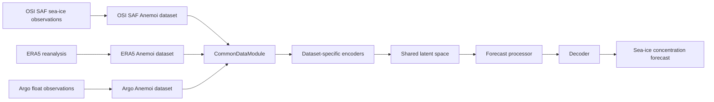

# IceNet Multimodal Pipeline

[](https://github.com/alan-turing-institute/icenet-mp/actions/workflows/test_code.yaml)
[](https://github.com/alan-turing-institute/icenet-mp/actions/workflows/build_docs.yml)
[](https://github.com/alan-turing-institute/icenet-mp/actions/workflows/code_style.yaml)
[](LICENSE)

IceNet-MP is an **AI/ML framework for multimodal sea-ice forecasting**.


IceNet-MP fuses satellite observations, Argo float sensor data, and ERA5 reanalysis fields to produce short-term sea ice concentration forecasts. The encode-process-decode architecture translates each input dataset into a shared latent space, allowing new data sources and ML model components to be added without changing the full pipeline.



Each data source is downloaded and prepared through its own Anemoi dataset configuration before being combined by the data module. See [Add a model](https://alan-turing-institute.github.io/icenet-mp/how-to/add-a-model/) for the standalone and encode-process-decode model interfaces.

## Quick start

```bash
git clone git@github.com:alan-turing-institute/icenet-mp.git
cd icenet-mp
uv sync --managed-python
```

Create a local config in `icenet_mp/config/` (see [Configuration](https://alan-turing-institute.github.io/icenet-mp/user-guide/configuration/) for details):

```yaml
# icenet_mp/config/my.local.yaml
defaults:
  - base
  - _self_

base_path: /path/to/my/data
```

Then download datasets and train:

```bash
uv run imp datasets create --config-name my.local
uv run imp train --config-name my.local
```

Evaluate a checkpoint:

```bash
uv run imp evaluate --checkpoint /path/to/checkpoint.ckpt --config-name my.local
```

## Documentation

- [Installation](https://alan-turing-institute.github.io/icenet-mp/user-guide/installation/) — prerequisites, `uv` setup, HPC-specific steps
- [Configuration](https://alan-turing-institute.github.io/icenet-mp/user-guide/configuration/) — local config files, model overrides, custom datasets
- [Commands](https://alan-turing-institute.github.io/icenet-mp/user-guide/commands/) — `datasets create`, `datasets inspect`, `train`, `evaluate`
- [Add a model](https://alan-turing-institute.github.io/icenet-mp/how-to/add-a-model/) — tensor format, standalone vs. processor model architectures

## Jupyter notebooks

The `notebooks/` folder contains demonstrator notebooks. Run them with:

```bash
uv run --group notebooks jupyter notebook
```

Start with `notebooks/demo_pipeline.ipynb` for a worked example of the full pipeline.
