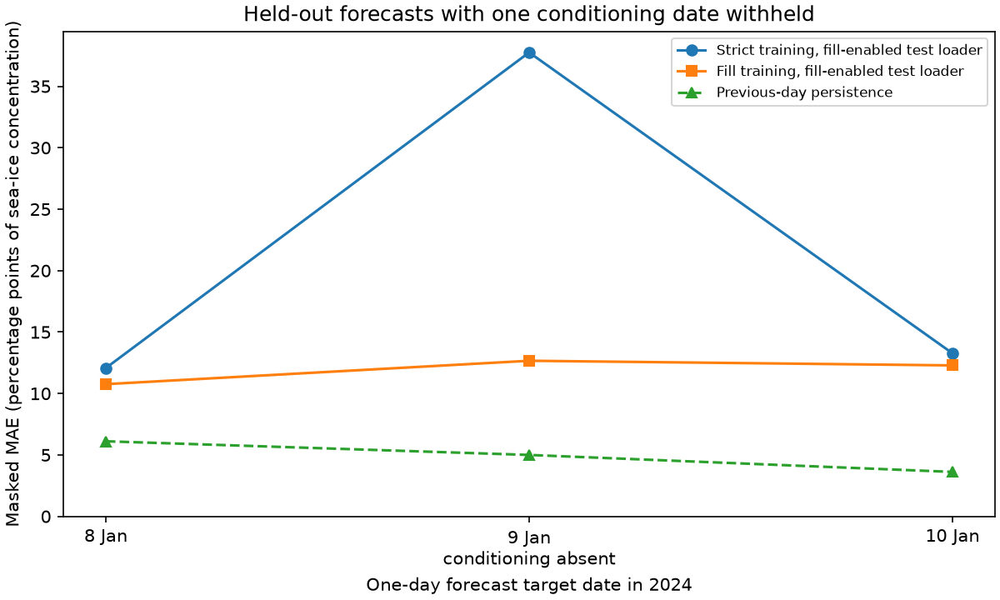
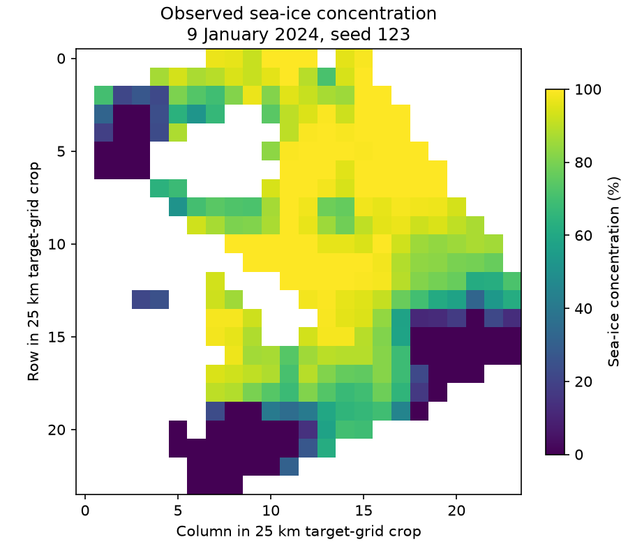
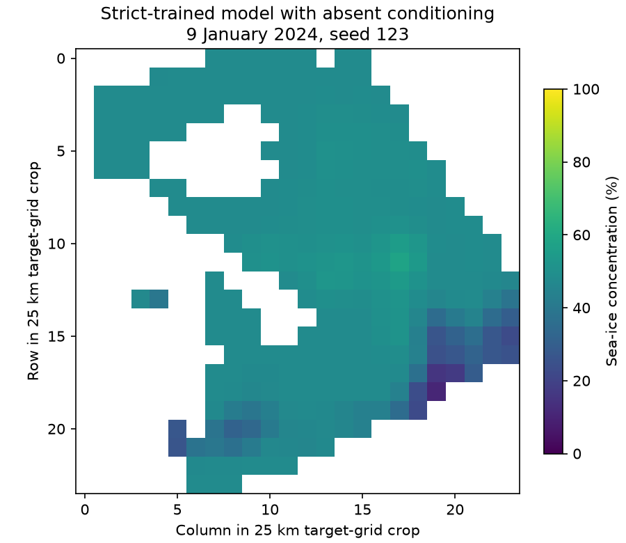
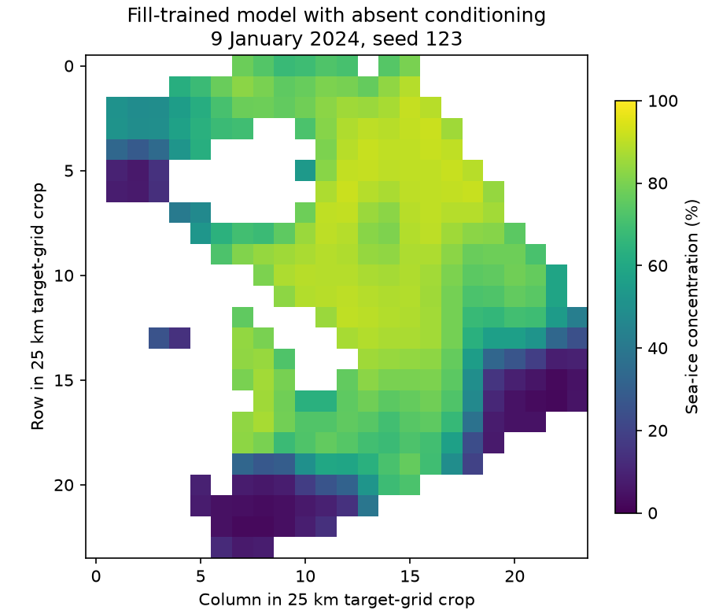

# Missing-conditioning training and forecast pilot

This adds a fresh, reproducible evaluation of CryoCast PR #452 with an explicit ocean mask and a held-out missing-conditioning case. It supplements the earlier South-pole pilot in the PR discussion; its smaller northern dataset and scores must not be pooled with that earlier result.

## Main result

The fill-enabled loader retains **5 training windows instead of 3** under the fixed two-date conditioning outage. With one held-out conditioning date removed, it retains **all 3 test windows instead of 2**. Mandatory target history and target observations are not removed or imputed.

Mean masked MAE across two seeds is **13.059** percentage points for strict training versus **12.082** for fill-enabled training on complete test inputs. With one conditioning date absent and the same three test forecasts produced through the fill-enabled loader, the corresponding values are **21.033** and **11.903**. The short-trained models remain substantially worse than previous-day persistence, at **4.910 MAE** and **9.364 RMSE**.

These are pilot observations, not evidence of production forecast improvement. Only three correlated held-out dates and two training seeds are evaluated. The default remains strict; this evidence supports keeping the capability opt-in while establishing that the real loader/model path runs with missing conditioning.

## Exact scores

Errors are percentage points of sea-ice concentration, evaluated over the same fixed 303 active-ocean pixels on 8, 9 and 10 January 2024. No clipping was used for metrics; the model decoder already enforces its configured sigmoid range.

| Seed | Training policy | Train seconds | Complete-input MAE | Complete-input RMSE | Missing-input MAE | Missing-input RMSE |
|---|---|---:|---:|---:|---:|---:|
| 123 | strict | 2.809 | 13.000 | 15.696 | 20.867 | 25.994 |
| 123 | fill | 1.770 | 11.294 | 14.612 | 11.119 | 14.006 |
| 456 | fill | 1.708 | 12.871 | 16.241 | 12.688 | 16.168 |
| 456 | strict | 1.425 | 13.119 | 16.580 | 21.199 | 28.471 |


For the missing-input score, **both trained models use the fill-enabled loader** so the evaluation covers exactly the same three targets. An ordinary strict loader would drop the 9 January target when its 8 January conditioning observation is absent. Its reduced two-window average is deliberately not compared against the three-window average. This distinguishes training-policy effects from unequal test coverage.

## Timing

| Measurement | Strict path | Fill-enabled path |
|---|---:|---:|
| Model only, median ms/sample | 1.223 | 1.223 |
| Loader only, median ms/sample | 0.244 | 0.215 |
| Loader plus model, median ms/sample | 1.872 | 1.843 |


Both policies receive the same 200 optimizer steps, batch size two, and identical initial weights per seed. Training order is reversed for the second seed. Model-only and loader-plus-model timing use the same fixed trained model and complete-input windows; all tensors from the strict and fill-enabled complete-input paths are verified bit-identical. The model-only measurement uses five warmups and 40 interleaved calls; loader measurements use 12 alternating passes. The unmodified upstream strict loader also produces exactly the same dates and tensor values.

These are local macOS CPU measurements with two PyTorch threads and other development activity on the machine, not isolated benchmark guarantees. A repeat run reproduced parameter hashes and forecast scores exactly but had substantially different elapsed times. The timing evidence therefore does not establish a precise percentage speedup or slowdown. Raw per-seed times and both timing runs are retained in the JSON files.

## Data and controls

- Ten days, 1–10 January 2024 at noon, from the existing public EUMETSAT/OSI SAF sea-ice concentration cache and C3S CARRA2 sea-ice concentration reanalysis cache.
- Fixed 24×24 target-grid crop around 78°N, 25°E. CARRA2 is mapped to these target points by nearest neighbour on the unit sphere. The retained points are at most 1.647 km from their source neighbour.
- Mask derives only from 1–6 January target status flags and finite training-source values, intersected with fixed geographic coverage. Excluded pixels are zero in both input stores. There is no future-data-derived mask selection.
- Physical concentration fractions already lie in [0,1]; `SingleDataset(normalise=False)` avoids using any fitted normalization statistics.
- Train targets are 2–6 January. Conditioning observations on 2 and 4 January are withheld before constructing date-to-index caches. Target history and targets remain complete. The validation date 7 January is not used for checkpoint selection.
- Test targets are 8–10 January, each with one day of observed history and one-day lead. Conditioning on 8 January is withheld for the missing-test scenario. These are rolling-origin hindcasts, not an autoregressive three-day trajectory.
- Actual `CombinedDataset`, `SingleDataset`, `EncodeProcessDecode`, `NaiveLinearEncoder`, `UNetProcessor` and `NaiveLinearDecoder` are used. Latent grid 32×32, eight starting U-Net channels, Adam 0.001. Each seed's two treatments share initial weights and receive exactly 200 updates. Seeds are 123 and 456.

CARRA2 is reanalysis, not an independent real-time observation stream. This experiment does not validate operational data-arrival delays or independence of data sources. The earlier 2020–2021/2024 South-pole pilot remains separately documented at https://github.com/alan-turing-institute/cryocast/pull/452#issuecomment-5622298939.

## Forecast figures

The missing-conditioning target date and first predetermined seed are shown. These are array-grid plots, not a georeferenced map. All panels use the same 0–100% display scale, and masked pixels are blank.









## Reproduction

The evidence branch retains PR source `393157f8152ef068bbf8d42198f0d2aac7641637`. With its development dependencies available, from the repository root:

```sh
python validation/missing-452/prepare_reader_stores.py
PYTHONPATH=. WANDB_MODE=disabled python validation/missing-452/run_comparison.py
python validation/missing-452/make_evidence.py
```

A complete clone containing upstream commit `57057d009c485911eb99b59fc99708ae53af8870` is needed for the strict-path equality check. The scripts create only local derived reader stores and result files. No credentials, external downloads, model registry or remote experiment tracker are used. `input_observations.npz` has SHA-256 `1e8cbd8bfd056d57c25892124405238bcad67ffd1fbfc3e9293e54aca1907ec2`. Its small derived crop is attributed to EUMETSAT/OSI SAF (CC-BY-4.0) and Copernicus Climate Change Service (C3S) / ECMWF CARRA2 (CC-BY-4.0 as recorded by the source ingestion configuration); source filenames and transformations are recorded in `design.json`. This is a modified sample, not an official reissued data product. No private datasets or trained model checkpoints are included.

The first clean run and the self-contained reader-store rebuild have identical initial/final state hashes, complete/missing test scores and daily metrics for all four arms. The runtime was Torch 2.14.1 on CPU. Cross-platform bitwise equality is not promised.
