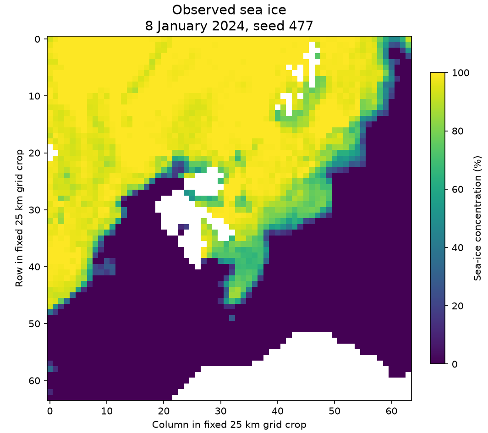
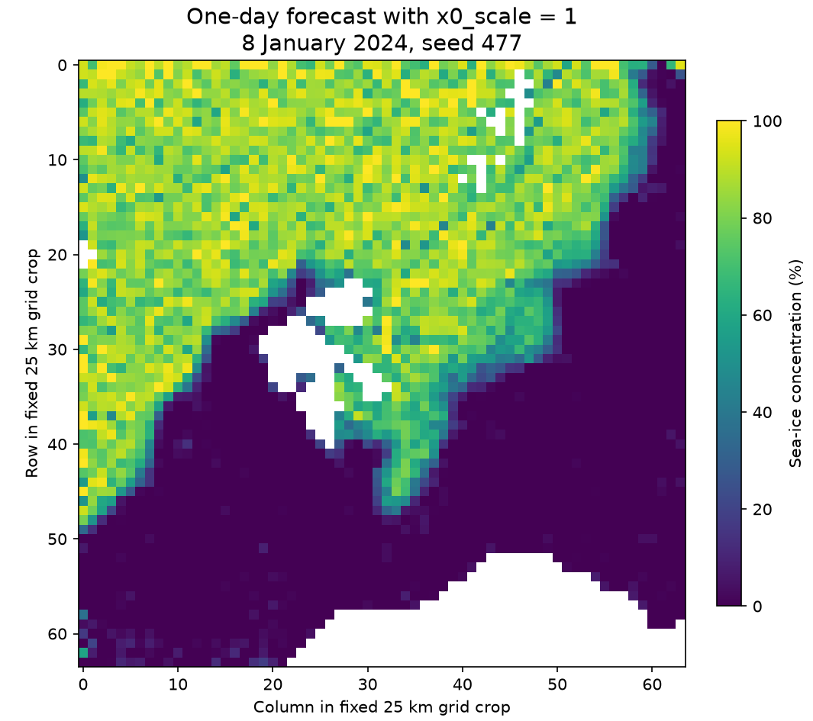
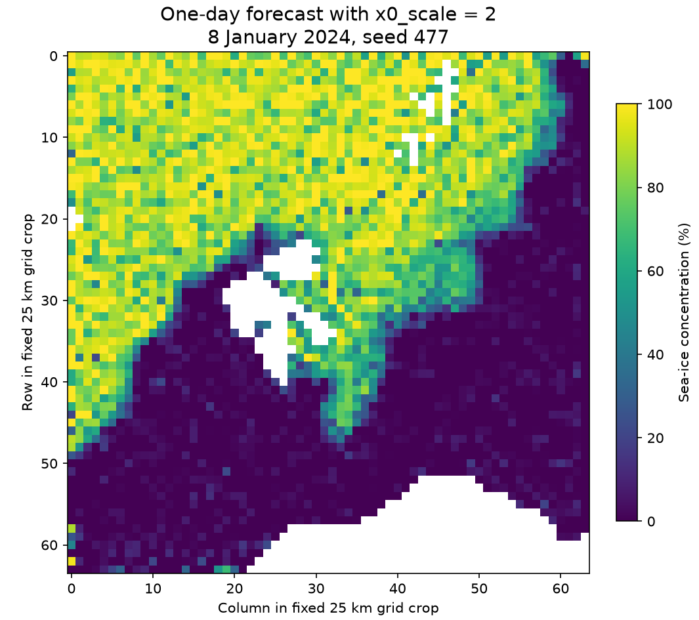
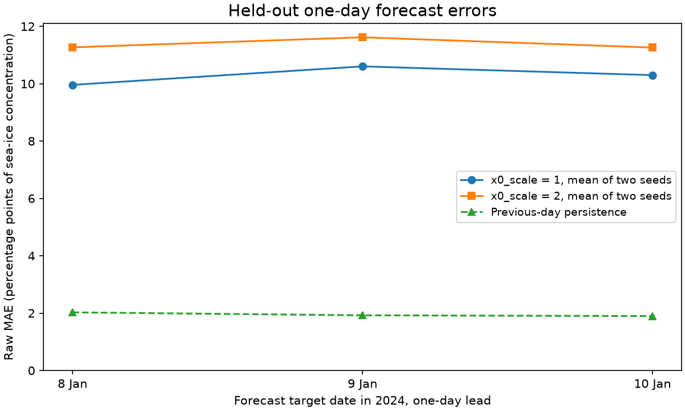

# Matched x0 scaling forecast pilot

This records actual training and forecast evaluation for IceNet PR #478. **The pilot does not show a benefit from `x0_scale=2.0`.** Raw MAE and RMSE worsen for both paired training seeds. Across the two seeds, mean raw MAE changes from **10.287** to **11.383** percentage points, and mean raw RMSE from **13.353** to **15.781**. The default should remain `1.0`.

## Results

All metrics below are percentage points of sea-ice concentration. Each row evaluates the same three one-day forecasts over the same 3,649 fixed active-ocean pixels. Raw predictions are the primary comparison. Clipped metrics are reported separately and do not replace the raw result.

| Seed | x0_scale | Raw MAE | Raw RMSE | Raw bias | Clipped MAE | Clipped RMSE |
|---|---|---|---|---|---|---|
| 477 | 1 | 11.818 | 15.560 | -9.470 | 9.128 | 14.603 |
| 477 | 2 | 12.057 | 16.983 | -7.429 | 9.075 | 15.197 |
| 478 | 1 | 8.756 | 11.147 | -6.290 | 6.116 | 9.952 |
| 478 | 2 | 10.709 | 14.579 | -7.624 | 6.616 | 11.793 |


Previous-day persistence has raw MAE **1.949** and RMSE **5.884** percentage points, substantially better than either short-trained model. Mean training-field climatology has MAE **6.968** and RMSE **15.963**. This is a limited experiment, not evidence of an operationally useful forecast model. The two-seed means above are arithmetic means of the per-seed metrics, not significance estimates or pooled confidence intervals.

## Controlled comparison

The experiment uses the repository's actual `DiffusionProcessor`, conditional U-Net and DDIM sampler on an observed OSI SAF sea-ice concentration slice. Each seed's two arms start with identical hashed state dictionaries. Training timestep draws, Gaussian noise and sampling noise are paired. Only `x0_scale` changes between the two arms.

The original processor from base `6b2764b241f630d6146ab90c9877c7706aa9fa99` is loaded separately. At scale 1.0, the PR matches that original code bit-for-bit for training loss, training prediction and sampling with identical weights and random seeds. Both scale arms are then trained from the same initial checkpoint for 120 updates; the final checkpoint is evaluated without selecting on validation or test scores.

- Observations cover 1–10 January 2024 at 12:00 UTC, on the native 25 km grid. A 64×64 crop is centred on the grid point nearest 78°N, 25°E, fixed before either run.
- Five training pairs forecast target dates 2–6 January from the preceding day's observation. Mean, standard deviation and active/ocean mask are derived only from observations on 1–6 January.
- Validation target is 7 January. Held-out target dates are 8, 9 and 10 January, each with a one-day lead and its own observed previous-day input. These are three rolling-origin hindcasts, not a three-day autoregressive forecast from one origin.
- The encoder and decoder are fixed affine transforms using training-only mean and standard deviation. A fixed ocean-mask channel accompanies the SIC history. This is not an experiment with a pretrained production encoder.
- Two seeds, 477 and 478; 901,217 trainable parameters; AdamW with learning rate 0.001 and weight decay 0.0001; full training batch; gradient clipping at 1.0; identical masked velocity loss.
- 32 training diffusion steps and 32 deterministic DDIM sampling steps, eta 0. Four matched-noise ensemble members are averaged per forecast.

## Prediction figures

The first held-out date and first predeclared seed are shown, not the most favourable case. These are native-grid array views, not projected geographic maps. Pixels excluded by the fixed mask are blank. All three figures share a 0–100% display scale. Forecast values are clipped only for these figures; raw metrics retain out-of-range values.









## Reproduction

The branch retains the exact PR source at `7576b6023c26b36b2da1e16a190f84c8783c8c49` and adds only this evidence directory. Install the repository development environment, then from the repository root run:

```sh
python validation/x0scale-478/run_comparison.py \
  --input validation/x0scale-478/input_slice.npz \
  --design validation/x0scale-478/design.json \
  --output /path/to/local/results \
  --baseline-ref 6b2764b241f630d6146ab90c9877c7706aa9fa99
```

Use a complete clone containing the baseline commit. `run_comparison.py` writes local checkpoints and metrics to the supplied output directory and performs the base-equivalence checks. No external service, experiment-tracking endpoint or remote training job is required. The checked-in input slice has SHA-256 `34c5417d5ef1a6283de23accda8a344751bb75c91b402c1074c92dd07b38a0bf`. Reproduction across Torch versions or hardware may differ despite deterministic settings; the recorded run used Torch 2.14.1, NumPy 2.4.6 and macOS CPU.

`design.json`, `metrics.csv`, `results.json` and `predictions.npz` contain inspectable configuration, state hashes, numerical results and forecast arrays. Large model checkpoints are deliberately excluded from Git. The small input slice is derived from the cached public EUMETSAT/OSI SAF dataset, attributed under CC-BY-4.0 as recorded in the repository ingestion configuration. The source filename template and processing details are retained in `design.json`. No private observational dataset or credentials are included.

## Limits

Ten winter observation dates, five training targets, three correlated test dates, one spatial crop, two seeds and a short training budget do not establish a reliable effect size or generalisation across seasons, regions or operational checkpoints. The existing default matches the old code; changing the experimental scaling knob is not justified as a forecast-skill improvement by this pilot. A multi-year benchmark with the intended learned encoder would be needed for that claim.
